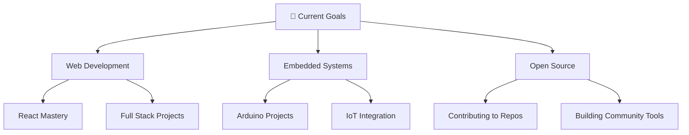

# 👋 Welcome to My Digital Universe!

<div align="center">
  
  <!-- Animated Typing Text -->
  
  
  <!-- Profile Views Counter -->
  
  
  <!-- Wave Header -->
  
  
</div>

---

## 🌟 About Me


```yaml
name: Belaib Haitem
location: Constantine, Algeria 🇩🇿
education: Computer Science @ ESTIN Bejaia
focus: ["Web Development", "Embedded Systems", "Problem Solving"]
currently_learning: ["Advanced React Patterns", "IoT Integration", "System Design"]
fun_fact: "I debug with console.log() and I'm not ashamed! 😅"
motto: "Code with passion, debug with patience"
```

- 🎓 **Student** at ESTIN Bejaia, passionate about Computer Science
- 🔭 **Currently working on** cutting-edge web applications and Arduino projects
- 🌱 **Always learning** new technologies and best practices
- ⚡ **Love building** practical tools that solve real-world problems
- 🎯 **Goal:** Contributing to open-source and building impactful software
- 📫 **Reach me at:** [Your Email] | [Your LinkedIn]

---

## 🛠️ Tech Arsenal

<div align="center">

### 💻 Programming Languages


### 🚀 Frameworks & Libraries  


### 🔧 Tools & Platforms


### 📊 Databases


</div>

---

## 🏆 Featured Projects

<div align="center">

### 🌟 Highlighted Repositories

<table>
<tr>
<td width="50%">

**🔢 Base Converter in C**
- Advanced number system converter
- Clean C implementation
- Multiple base support (2-36)
- [View Project →](https://github.com/bl-haitem/base-convertor-in-c)

</td>
<td width="50%">

**📺 YouTube Playlist Downloader**
- Bulk video downloading tool
- Python-powered automation
- User-friendly interface
- [View Project →](https://github.com/bl-haitem/Y-playlist-downloader)

</td>
</tr>
<tr>
<td width="50%">

**🚨 Arduino Alert System**
- IoT-enabled monitoring system
- Web integration capabilities
- Real-time notifications
- [View Project →](https://github.com/bl-haitem/alert-sys-arduino-web)

</td>
<td width="50%">

**💼 Personal Portfolio**
- Modern web portfolio
- Responsive design
- Interactive UI/UX
- [View Project →](https://github.com/bl-haitem/portfolio)

</td>
</tr>
</table>

### 📌 Repository Cards
<a href="https://github.com/bl-haitem/base-convertor-in-c">
  
</a>
<a href="https://github.com/bl-haitem/Y-playlist-downloader">
  
</a>

</div>

---

## 📊 GitHub Analytics

<div align="center">
  


</div>

---

## 🔥 Contribution Stats

<div align="center">
  


</div>

---

## 💡 Current Focus

<div align="center">



</div>

---

## 🎵 Currently Coding To
<div align="center">
  
[](https://github.com/kittinan/spotify-github-profile)

</div>

---

## 🤝 Let's Connect!

<div align="center">
  
[](YOUR_LINKEDIN_URL)
[](mailto:YOUR_EMAIL)
[](YOUR_PORTFOLIO_URL)
[](YOUR_DISCORD)

</div>

---

## ⭐ Fun Facts & Quotes

<div align="center">

> *"First, solve the problem. Then, write the code."* - John Johnson

**🎮 When I'm not coding:** Gaming, exploring new tech, contributing to open-source  
**☕ Fuel:** Coffee and determination  
**🌍 Dream:** Building software that makes a positive impact globally  

</div>

---

<div align="center">
  
### 🙏 Thanks for visiting!
  
**If you like my work, consider:**
- ⭐ Starring my repositories
- 🍴 Forking interesting projects  
- 📫 Connecting for collaboration


**Made with ❤️ and lots of ☕**

</div>
